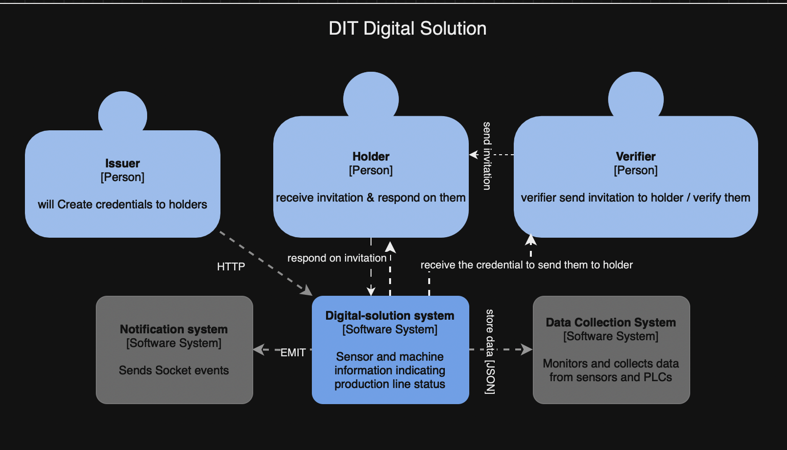

# Digital Identity Backend
basic Digital Identity solution, the backend will expose 2 communication channels/transports and will mix them together, the first is REST API, the second utilizes WebSockets ultimately is an API/event based system, you have 3 actors in the system
Issuers, issuers can issue credentials

## DIT digital solution highlevel workflow

## Run the Application using terminal
1. Clone the repository.
2. Install dependencies: `npm install`
3. Start the application: `npm run start`

## Test
Run `npm test` to execute unit tests.

## Run using Docker
1. Clone the repository.
2. go to the root for this repo where the docker compose file is
3. Build the Docker compose file by write this on the terminal: `docker compose up --build -d`

## Swagger Documentation
Visit `http://localhost:8082/doc` for Swagger documentation.
